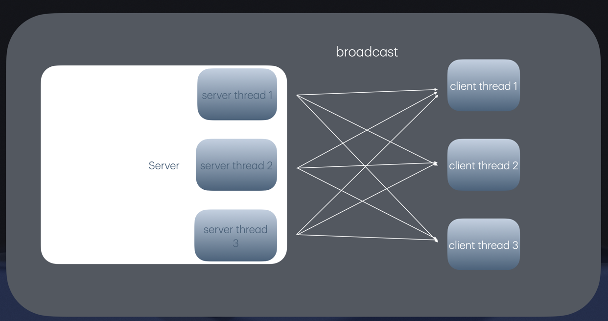

# JAVA CHAT PROGRAM    
multi thread chat program   
made : 2019/12 

# 아키텍쳐

- 유저의 한 request당 이를 관리하는 서버 쓰레드가 필요하여 위와 같이 구현하였습니다.
- 각각의 서버 쓰레드는 유저가 접속하고 나갈때마다 유저 IO 정보를 동기화합니다.
- 유저가 메시지를 입력하거나 새로운 정보를 전파할때 브로드캐스팅합니다.

# 실행 화면

